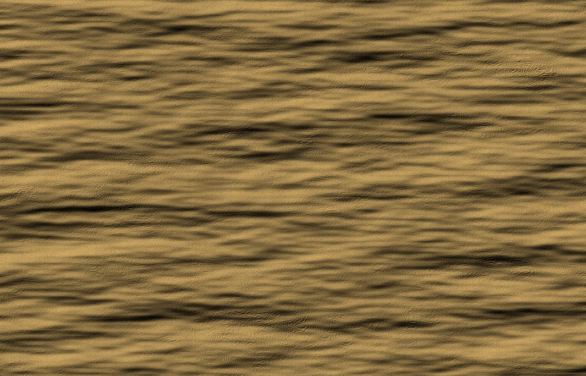
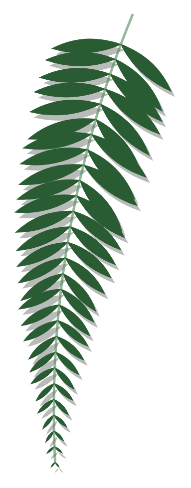

# Img.Maze

*a cross-canon bestiary maze · prototype (in-progress version) · four pages*

A collage website that is moved through like a maze. There is no menu and no text telling a visitor where to go: the pictures are the links. It is plain HTML with one external stylesheet (`stylesheets/mystyles.css`). **There is no JavaScript.** Every effect, including every animation started by a click, is CSS.

**To look at it:** unzip the folder and open `index.html` in a browser (no server needed). Nothing on the pages says what can be clicked. That is the idea, so section 2 lists what to try.

**Short on time:** sections 1, 2 and 6 are the reading (about ten minutes: the interpretation, what to try, and what feedback would help). Section 3 is the reference for the code, one technique at a time.

| Page | Environment | The CSS technique the page is built around |
|---|---|---|
| `index.html` (Landing) | every canon mixed in one pile | `z-index` cluster |
| `water.html` | a long dive into deep water | `position:fixed` + `position:sticky` |
| `desert.html` | a dragon far bigger than the window | `position:absolute` + extreme scale (and `relative`) |
| `forest.html` | a storybook that scrolls left to right | `z-index` depth + `position:relative` |

**Contents:** 1 The brief and how it was read · 2 A tour · 3 The code in depth · 4 Making the pictures · 5 Checking it · 6 Limits, next steps and questions · 7 Files and credits

---

## 1. The brief and how it was read

### 1.1 What this stage asks for

The assignment page asks for a prototype (an in-progress version) of the Img.Maze website:

- at least three interlinked pages, each with at least two functioning points of interaction;
- layouts that need not be finished but should be close, so that feedback can address how well they work, conceptually and technically;
- all CSS in an external stylesheet (no `<style>` tags in the `<head>`);
- a single project folder of working files and assets, compressed to a ZIP.

| Asked for | What this submission has |
|---|---|
| Three or more interlinked pages | Four. Every page has two ways out and none is a dead end. All four can be walked in a loop by clicking only: Landing → Water → Desert → Forest → Landing. |
| Two or more interactions on each page | At least four on every page (section 2 lists them). Five of them are animations started by a click. |
| Layouts close to finished | Every page is composed as intended and sized in window-relative units, so it holds from a projector to a phone. What is left is polish (section 6). |
| External CSS only | One stylesheet. No `<style>` tag, no `style=""` attribute, no script. |
| One folder, zipped | `Img.Maze/`: four pages, one stylesheet, `images/`, and this file. |

### 1.2 The idea

The ideation document (Project 01, September 2026) describes Img.Maze as "a multi-page collage website navigated like a maze — no menu, no directing text, images that are secretly links": a traveller's encyclopedia of creatures from across sci-fi and fantasy (Subnautica, Star Wars, Star Trek, Tolkien and deep time), "stitched together so canons that never meet coexist". Eleven creatures are grouped into environments, and each environment is a page.

### 1.3 Reading the references

The brief points to four sites: JODI, Olia Lialina's *My Boyfriend Came Back from the War*, Dina Kelberman's Tumblr and Rafaël Rozendaal's websites. They are very different, but they share a stance that this project takes as its starting point: **the page itself is the work, and a visitor finds a way through by looking and trying things, not by reading a menu.**

The ideation document adds a second lineage: collage. Its first part gathers twenty-five collage works, from Dada photomontage (Höch, Heartfield, Schwitters) through Stezaker, Ernst and Mutu to net-art, as a method of "fragmentation, unexpected juxtaposition, collage-as-interface". Img.Maze is where the two meet: a collage that is also the interface.

### 1.4 From idea to rules

Reading the brief this way produced rules that every page follows.

1. **Wordless.** No menu, no labels, no instructions. The only text the site sets is cut-up lettering on the Landing, used as a texture until it is clicked.
2. **Pictures are the links, and a door is a stranger.** Every way out of a page is a creature or a scrap of material from somewhere else, pasted onto the page: a Wampa (a snow creature) lost in the sea, a lake monster lurking in forest roots, a patch of bark on a desert dragon. The ideation document puts it as "each internal link is a wrong-biome creature intruding on the page".
3. **A picture appears once on a page.** The Landing is the one place where all eleven creatures and all four textures are mixed. Elsewhere a creature stays on its own page or appears only as a door. (One deliberate exception: the Desert's top-left still and GIF are crops of the dragon's mouth.)
4. **The maze loops.** Each page has two exits and no "back" link, so a visitor circles instead of retracing. The plan was strictly one-way links; with the page count cut to four, two pairs of pages (Landing and Desert, Water and Forest) link both ways. The browser's own Back button still works; it is not part of the design.
5. **Each environment is one CSS technique.** The ideation document's "biome → technique" table ties every environment to a positioning technique, and the technique is the habitat. The Landing is a `z-index` pile with no focal point. Water is `fixed` and `sticky`: things hang in place while the page sinks past them, and the biggest creature is hidden. The Desert is `absolute` with extreme scale: one vast dragon, tiny things on it ("the scale-and-perception anchor"). The Forest is depth made literal in `z-index` layers. A fifth environment, Frozen ("stillness + thaw"), was planned and is not built; its creatures (Wampa, Tauntaun, Ravinak) appear as doors on other pages.
6. **Hints are small and always the same kind.** A hand cursor, a short wiggle or a slow sway, and a response to hover. The Landing's two doors wiggle twice, six seconds after the page loads; the Forest's page-turning ferns sway all the time; Water's hidden creature shows itself only as ripples. A visitor who never moves the pointer sees a pile of pictures and nothing more; a patient one finds the doors. How small a hint can be before the maze becomes a puzzle is the central design question (section 6).
7. **Collage is the visual language.** Torn-paper edges, drop shadows, a paper grain over everything, cut-up type, paper-cut forest layers, and the creature pictures pasted in as found material.

One constraint was added on purpose: **no JavaScript.** Effects that would normally be scripted (a button, a reveal, an animation started by a click) are built from HTML and CSS, so the whole site can be read as four pages of markup and one stylesheet.

### 1.5 What the feedback on the first assignment changed

The feedback asked for two things: to go further with the `animation` property, including animations triggered by clicking *other* elements; and to explore a horizontally scrolling layout, a storybook or storyboard that unfolds from left to right with interactive components. Both were treated as problems to solve inside HTML and CSS.

| Click | What plays | Section |
|---|---|---|
| any scrap of lettering (Landing) | the four scraps slide together and spell the name | 3.5 |
| the glitch patch (Water) | the hidden creature lunges and the whole reef shudders | 3.5, 3.6 |
| the sun or the sand patch (Desert) | night falls and the Le-matya prowls across the dunes | 3.4, 3.7 |
| the leaves (Forest) | they part and the light of the two trees spills out | 3.5, 3.8 |
| the raptor (Forest) | it bolts out of the grass | 3.8 |

The storybook is the Forest: three scenes in one wide strip, with ferns that turn the page (3.8).

---

## 2. A tour

Nothing on the pages says what is clickable. This is what each page does.

**Landing**
- Hover any piece: it jumps to the front, straightens and grows.
- Two pieces are doors and wiggle twice, six seconds after the page loads: the Reaper Leviathan (to Water) and the Krayt dragon (to Desert). A hand cursor marks them.
- Click any scrap of lettering: the four slide together and spell the name. Click again and they scatter.

**Water**
- Scroll: the water behind gets darker while the light and a hidden creature stay fixed to the window.
- Hover the corrupted patch: the hidden creature comes out of the murk. Click it: the creature lunges, the reef shudders, and it stays out until the patch is clicked again.
- The Wampa is sticky and is a door to the Forest. The swimming Le-matya at the very bottom is a door to the Desert. The kelp (top right) links out to a wiki.

**Desert**
- Click the sun (or the patch of sand at the bottom right): the desert goes to night and the tiny Le-matya prowls across the dunes. Click again for day.
- Hover the Le-matya: it swells. Hover the still in the top left: it plays as a GIF. Scroll: the sun is sticky.
- The bark patch is a door to the Forest, the ice patch a door to the Landing, and the hatched paper links out to an encyclopedia.

**Forest**
- Swipe sideways (trackpad, scroll bar or arrow keys) through three scenes, or click the fern hanging at the end of a scene to turn the page.
- Scene 1: hover the Ent card hiding behind a trunk and it leans out. It also links out to an encyclopedia.
- Scene 2: click the leaves hiding the big picture and they part. Click the picture and they close.
- Scene 3: click the raptor in the grass and it bolts. The Tauntaun is a door to the Landing and the Watcher a door to Water.

```
Landing → Water, Desert
Water   → Desert, Forest        (and the kelp, out to a wiki)
Desert  → Forest, Landing       (and the hatched paper, out to an encyclopedia)
Forest  → Landing, Water        (and the Ent card, out to an encyclopedia)
```

---

## 3. The code in depth

The comments in the code say what each block is for. This section explains the mechanism: why a rule works, and what breaks it. Excerpts are trimmed; `...` marks lines left out.

### 3.0 How to read the stylesheet

- One stylesheet serves all four pages. A contents list in its first comment names the sections (BASE, PAPER CUTS, one section per page, SMALL SCREENS) and each section begins with a banner comment.
- The conventions are those of the Week 2 demo: an `id` for each one-off picture, a `class` for a treatment that repeats, four-space indentation, `z-index:+4`-style numbers, one rule per element.
- Every `<body>` has an id (`landing`, `water`, `desert`, `forest`) so a rule can be limited to one page. Because the stylesheet is shared, **an id may be used on one page only**; section 3.11 shows what happens otherwise.

### 3.1 Stacking a collage: a relative parent, absolute pieces, `z-index` as order (Landing)

```css
#pile {
    position:relative;
    height:100vh;
    overflow:hidden;
    font-size:1vmax;
    ...
}

.piece {
    position:absolute;
    filter:drop-shadow(0 0.45em 0.8em rgba(24,14,6,0.42));
    transition:rotate 0.5s, scale 0.4s, filter 0.4s;
}

#reaperDoor {
    left:6%;
    top:6%;
    width:36em;
    rotate:-5deg;
    z-index:+12;
}

#pile .piece:hover {
    z-index:+100;
    rotate:0deg;
    scale:1.04;
    ...
}
```

1. `#pile` is `position:relative`, which makes it the box its pieces are measured from. `.piece` is `position:absolute`, which takes a piece out of the normal flow and lets `left` and `top` put it anywhere inside the pile, as a percentage of the pile. Remove `position:absolute` and the collage collapses into one long column: the Reaper lands more than 5,000 px down the page.
2. `z-index` decides which piece is nearer. The numbers are the HTML order, back to front (+1 to +21), so the order in which the markup is read is the order in which the pieces stack. Give `#reaperDoor` a `z-index` of 0 and it sinks behind the paper and disappears.
3. Widths are in `em`, and `#pile` sets `font-size:1vmax` (1% of the window's longer side). So 1em is 1% of the longer side, every piece scales with the window, and the drop shadows (also in `em`) scale with them. One rule in the `@media` block, `#pile { font-size:1.45vmax; }`, resizes the whole pile for a phone.
4. The hover rule begins with `#pile` on purpose. Each piece sets its own `rotate` and `z-index` in an id rule (specificity: one id), and a bare `.piece:hover` (one class, one pseudo-class) would lose to it. `#pile .piece:hover` (one id, one class, one pseudo-class) wins.
5. `rotate` and `scale` are written as properties of their own, not inside one `transform`. Each can change or animate alone: the hover straightens `rotate` while the doors' wiggle changes only `scale`, and neither overwrites the other.

### 3.2 A hint without words: `cursor` and a short `animation` (Landing)

```css
.door {
    cursor:pointer;
    animation:wiggle 2.2s ease-in-out 6s 2;
}

@keyframes wiggle {
    0%, 100% { scale:1; }
    35% { scale:1.06; }
    70% { scale:1.02; }
}
```

The two doors look like every other piece. The hand cursor and this wiggle are the only clues. The shorthand reads: name, duration (2.2 s), easing, delay (6 s), count (2). So the wiggle starts six seconds after the page loads, plays twice and never again: the hint is there for a patient visitor and gone for everyone else. `@keyframes` lists poses at percentages of the duration and the browser fills in between; `0%, 100%` shares one pose between the first and last frame, so the piece ends where it began.

### 3.3 Torn paper and paper grain (every page)

```html
<div class="piece" id="ravinak"></div>
```

```css
.cutE { clip-path:polygon(0% 2%, 24% 0%, 51% 3%, 78% 0%, 100% 18%, 98% 45%, 100% 72%, 97% 100%, 60% 98%, 22% 100%, 0% 80%, 3% 42%); }

#grain {
    position:fixed;
    top:0;
    left:0;
    width:100%;
    height:100%;
    z-index:+9000;
    pointer-events:none;
    background-image:url(../images/textures/grain.png);
    mix-blend-mode:multiply;
    opacity:0.42;
}
```

1. `clip-path:polygon()` is a list of corner points (`x y`, as percentages of the picture). The eight classes `.cutA` to `.cutH` are eight hand-made torn edges, reused across the site.
2. The cut is on the `` and the shadow is on the wrapping `<div class="piece">`. The split is deliberate: a `filter` is applied before a `clip-path`, so a shadow on the same element as the cut would be cut off with it.
3. The grain is one fixed `<div>` over every page (the same device as `#fernborder` in the Week 2 demo). `pointer-events:none` lets the mouse pass through it, and `multiply` blends it into what is underneath instead of covering it.

### 3.4 A button with no JavaScript: the hidden checkbox (every page)

The Desert's sun, in HTML and CSS:

```html
<input type="checkbox" class="switch" id="night" aria-label="Day or night" />
<div id="sky"></div>
<div id="skyNight"></div>

<main id="dunes">
    ...
    <label id="sun" for="night" aria-label="The sun: click to change the light"></label>
    ...
    <label class="tex" id="sandTex" for="night"></label>
</main>
```

```css
.switch {
    position:absolute;
    left:-9999px;
}

#night:checked ~ #skyNight {
    opacity:1;
}

#night:checked ~ #dunes #sand {
    background-color:#2b2e51;
}
```

1. A `<label for="night">` is tied to the checkbox with that id by HTML itself: clicking the label ticks the box, with no script. Any number of labels can drive one box. Here the sun and the patch of sand are two buttons for one switch.
2. A ticked box matches `:checked`.
3. `~` (the general sibling combinator) selects the later siblings of the box (`#skyNight`, `#dunes`), and the descendant selectors carry on from there (`#dunes #sand`). One tick can restyle anything that comes after the box in the document.
4. Order matters, because `~` only looks forward. That is why the checkbox is the first thing in `<body>`. Move it to the end and it still ticks, but nothing changes.
5. The box is moved off the screen instead of hidden with `display:none`, because an element that is not displayed cannot take keyboard focus. Off the screen it can: Tab reaches it, Space ticks it, and a `:focus-visible` rule draws a ring round the sun. It has no text, so it carries an `aria-label` for screen readers.

The same pattern is used five times: `#night` (Desert), `#spell` (Landing), `#summon` (Water), `#peel` and `#dash` (Forest).

### 3.5 Animation started by a click (every page)

```css
/* Landing: the lettering gathers */
#spell:checked ~ #pile #typeG {
    z-index:+300;
    animation:gatherG 1.3s cubic-bezier(0.34, 1.4, 0.64, 1) 0.12s forwards;
}

@keyframes gatherG { to { left:39%; top:38%; rotate:-2deg; } }

/* Water: one click, two things move */
#summon:checked ~ #reef #anchor {
    animation:lunge 1.8s ease-out forwards;
}

#summon:checked ~ #reef #lair {
    animation:tremor 0.9s ease-in-out;
}

@keyframes lunge {
    35% { scale:1.45; }
    100% { scale:1.12; }
}

/* Forest: leaves part */
#peel:checked ~ #book #curtainL {
    animation:partsLeft 2.4s ease-in-out forwards;
}

@keyframes partsLeft {
    0% { translate:0 0; rotate:0deg; }
    20% { translate:1% 0.5%; rotate:1deg; }
    100% { translate:-112% -3%; rotate:-8deg; }
}
```

1. **The thing clicked is not the thing that moves.** The label is the button; the animation is attached to other elements further down the document, through the `~` chain from 3.4. In Water the clicked patch (`#lens`) does not animate at all: the creature lunges and its parent, the whole reef, shudders.
2. **`transition` for two states, `@keyframes` for a choreography.** Hover and day/night have two states and use `transition`. A click that should play out over time (stagger, overshoot, an intermediate pose) uses `@keyframes`.
3. **A frame list with only a `to`** (`gatherG`, and `lunge`, which has no `0%`) starts from wherever the element already is. Each lettering scrap keeps its own starting place in the pile and only its destination is written down. The creature lunges from whatever state it was in when clicked, hidden or already revealed by hovering.
4. **`forwards`** keeps the last frame after the animation ends. Without it, each scrap would jump back to the pile after 1.3 s. `tremor` has no `forwards` on purpose: the reef should return to rest.
5. **The delay (`0.12s`)** is stepped by 0.12 s per scrap, so the four arrive one after another. The `cubic-bezier` curve goes past 1, which overshoots the destination and settles back, so the scraps snap into place.
6. **Percentages in `translate`** are of the element's own size. `-112%` moves a leaf a little more than its own width, which takes it completely out of the scene; the scene has `overflow:hidden`, so what leaves is cut off. The 20% frame is a small shudder before the leaves swing away.
7. **Un-ticking removes the animation**, so everything snaps back to where it started. A smooth reverse would need a second hidden box for every effect, or a script. This is a known limit (section 6).
8. The lettering also changes size as it gathers: in the pile the type is larger than its scrap (`font-size:17vmax`), so only a bit of each letter shows; ticking the box sets `#spell:checked ~ #pile .scrap { font-size:9vmax; }` and a `transition` on `.scrap` shrinks it so the name can be read. In the pile the lettering is texture; in the row it is a message.

### 3.6 Water: a scrolling background under fixed layers

```css
#water {
    background-image:linear-gradient(180deg, #bff4f8 0%, #46b4cc 10%, #1c7ea8 28%, #0f4f7f 52%, #072a4d 76%, #031425 100%);
}

#reef {
    position:fixed;
    top:0;
    left:0;
    width:100%;
    height:100%;
    z-index:+1;
    pointer-events:none;
}

#water main {
    position:relative;
    z-index:+2;
    height:460vh;
    overflow-x:clip;
    pointer-events:none;
}

#water main a {
    pointer-events:auto;
}

#stickyWampa {
    position:sticky;
    top:58vh;
    ...
}
```

1. **Sinking is a scrolling gradient.** The gradient is on `<body>` and is not fixed, so it is as tall as the page (460vh) and scrolls with it: the visitor travels from light water to dark water.
2. **Staying still is `position:fixed`.** Fixed is measured from the window, not the page, so `#lightWebs`, `#snow` and `#reef` (which holds the hidden creature) do not move while everything else scrolls past.
3. **The page covers the reef, so the mouse must pass through it.** `main` (`z-index` 2) lies over `#reef` (1) and is as tall as the dive. `pointer-events:none` lets the pointer fall through the empty page to the reef below, and links opt back in with `pointer-events:auto`. Set `main` to `auto` and the hover on the glitch patch stops working, because the mouse lands on the page instead.
4. **`overflow-x:clip`, not `hidden`.** `hidden` turns `main` into a scroll container, which would stop `position:sticky` from sticking to the window. `clip` trims the overflow without that side effect.
5. **`position:sticky; top:58vh`.** The Wampa sits in the page like any other element until the scroll brings it to 58% of the way down the window; then it stays there until `main` ends.

The hidden creature and its reveal:

```css
#anchor {
    width:100%;
    height:auto;
    border-radius:50%;
    opacity:0.34;
    scale:0.75;
    filter:blur(13px) brightness(0.8) saturate(0.8);
    transition:all 1.5s ease 1.8s;
}

#lens:hover ~ #anchorBox #anchor,
#summon:focus-visible ~ #reef #anchorBox #anchor,
#summon:checked ~ #reef #anchorBox #anchor {
    opacity:1;
    scale:1;
    filter:none;
    border-radius:0;
    transition:all 0.8s;
}
```

1. The creature starts as a dim, blurred, shrunken, round-edged shape in the water. The reveal rule restores everything.
2. **A transition belongs to the state being entered.** Entering the revealed state uses `all 0.8s` (quick). Leaving it uses the base rule's `all 1.5s ease 1.8s`: a 1.8 s pause, then a slow sink. Two speeds from two declarations, with no extra elements.
3. **`#lens` must come before `#anchorBox` in the HTML** (`~` looks forward). Swap them and hovering the patch does nothing.
4. `:focus-visible` means "focused with the keyboard", so Tab reveals the creature but a mouse click does not leave it stuck out (with `:focus` it did, which is how the difference was found).

The ripples that give the creature away:

```css
#ripples::before, #ripples::after {
    content:"";
    position:absolute;
    left:28%;
    top:30%;
    width:44%;
    aspect-ratio:1;
    border-radius:50%;
    border:1px solid rgba(190,255,255,0.4);
    animation:ripple 7s ease-out infinite;
}

#ripples::after {
    animation-delay:3.5s;
}

@keyframes ripple {
    from { scale:0.15; opacity:0.9; }
    to { scale:1.9; opacity:0; }
}
```

`::before` and `::after` add two rings without any extra HTML. Each ring grows and fades over 7 s, forever; the second starts half a cycle (3.5 s) behind, so there is always a ring in motion. `aspect-ratio:1` plus `border-radius:50%` makes a circle from a width alone.

### 3.7 Desert: percentages glued to a huge picture, crossfades, a sticky sun

```css
#colossus {
    position:absolute;
    left:-2vw;
    top:17vh;
    width:104vw;
    z-index:+2;
}

#iceTex {
    left:-1%;
    top:6%;
    width:9%;
    rotate:-6deg;
}
```

The dragon is one picture wider than the window (104vw). In the HTML the textures are children of `#colossus`, so their `%` values are fractions of the dragon, not of the page: `#iceTex` stays on the same spot of the picture at any window size. Placed on the page instead, it would slide off the dragon whenever the window changed shape.

Day and night are crossfades:

```css
#skyNight {
    background-image: ... ;
    opacity:0;
    transition:opacity 1.4s;
}

#night:checked ~ #skyNight {
    opacity:1;
}

#krayt {
    filter:sepia(0.28) saturate(1.2) brightness(1.1) hue-rotate(0deg);
    transition:filter 1.4s;
}

#night:checked ~ #dunes #krayt {
    filter:sepia(0.28) saturate(0.7) brightness(0.45) hue-rotate(190deg);
}
```

1. A gradient cannot be transitioned (a changed `background-image` just jumps), so the night sky is a second layer on top whose `opacity` fades in.
2. For the dragon, the two `filter` lists contain the same functions in the same order and only the numbers differ. That is what lets the browser interpolate between them. Give one state a function the other lacks and the change jumps instead of fading.

The sun is sticky, and the Le-matya is relative:

```css
#rail {
    position:absolute;
    top:0;
    right:0;
    bottom:0;
    width:24vw;
    z-index:+6;
    pointer-events:none;
}

#sun {
    position:sticky;
    top:4vh;
    ...
    pointer-events:auto;
}

#leMatya {
    position:relative;
    top:86vh;
    left:11vw;
    width:8vw;
    ...
}

@keyframes prowl {
    0% { left:11vw; top:86vh; }
    12% { top:85vh; }
    25% { top:86.4vh; }
    ...
    100% { left:78vw; top:86vh; }
}
```

1. A sticky element needs a tall box to stick within. `#rail` is as tall as the whole page, and the sun sticks 4vh from the top of the window inside it, so it stays in the sky while the sand scrolls underneath. The rail ignores the mouse and the sun opts back in.
2. `position:relative` keeps the Le-matya in its natural place in the flow and offsets it from there with `top` and `left`. Animating those two values moves it without disturbing anything else on the page. `left` carries it across the dunes; the small zigzag in `top` (85vh and 86.4vh) is a bob, so it walks rather than slides.

### 3.8 Forest: a sideways book

```html
<main id="book" tabindex="0" aria-label="The forest: a picture story that scrolls sideways">
    <div id="strip">
        ...
        <section class="scene" id="scene1">
            ...
            <a class="leaf" id="leaf1" href="#scene2" aria-label="Next: deeper into the forest"></a>
        </section>
        ...
    </div>
</main>
```

```css
#book {
    position:fixed;
    top:0;
    left:0;
    width:100%;
    height:100%;
    overflow-x:auto;
    overflow-y:hidden;
    scroll-snap-type:x mandatory;
    scroll-behavior:smooth;
}

#strip {
    position:relative;
    display:flex;
    width:300vw;
    height:100%;
    ...
}

.scene {
    position:relative;
    flex:0 0 100vw;
    height:100%;
    overflow:hidden;
    scroll-snap-align:start;
}
```

1. **The page does not scroll; the book does.** `position:fixed` pins `#book` to the window and `overflow-x:auto; overflow-y:hidden` lets it scroll sideways only. Only one thing moves, and the window is the book's cover.
2. **A strip of three windows.** `#strip` is a flex row 300vw wide. Each `.scene` is `flex:0 0 100vw`: it neither grows nor shrinks, so it is exactly one window.
3. **Snap.** `scroll-snap-type:x mandatory` with `scroll-snap-align:start` makes the book settle on a whole scene after a swipe, like a page.
4. **Turning the page needs no script.** `href="#scene2"` is an ordinary link to the id of the next scene. The browser scrolls the nearest scrollable box, here the book, to show it, and `scroll-behavior:smooth` makes it glide. A plain mouse wheel only scrolls up and down, so the ferns are the route for a mouse; a trackpad swipe, the scroll bar and the arrow keys (the book has `tabindex="0"` so it can take focus) also work.
5. **Each scene is its own canvas.** `position:relative` on `.scene` makes it the box that everything inside is measured from, so every `left`, `top` and `width` in a scene is a percentage of that scene. `overflow:hidden` trims whatever leaves it (the parted leaves).

Depth is the `z-index` ladder. All the layers share one stacking context (the fixed book), so the numbers compare across all three scenes:

| z-index | Layer | Elements |
|---|---|---|
| 1 | far trees (one picture behind all three scenes) | `#far` |
| 2 | a wash of colour: mist, deeper green, dusk | `#shade` |
| 3 | creatures behind the trunks | `#entCard`, `#twoTrees`, `#tauntaunDoor` |
| 4 | trunks (one picture each) | `.trunk` |
| 5 | creatures in front of the trunks | `#fernRaptor`, `#watcherDoor` |
| 6 | grass (one picture along the floor) | `#grass` |
| 7 | the nearest trunks, the leaves, the tufts | `.near`, `.curtain`, `.clump` |
| 8 | the ferns that turn the page | `.leaf` |
| 9 | the seam between scenes | `.scene::after` |
| 9000 | the paper grain | `#grain` |

1. **Hiding is just stacking.** The Ent card (3) is behind the trunk (4), so half of it is hidden; its hover rule slides it out. The raptor (5) is in front of the trunks but behind the grass (6), so only its head and back show, until the click rule raises it to 8 and sends it across the scene.
2. `.near` trunks sit at 7 and are darkened with `filter:brightness(0.55)`, so a scene looks as if the visitor is standing among the trees.
3. Everything in the layers is `pointer-events:none` (trunks, grass, tufts, the colour wash) so the mouse reaches the creatures and leaves behind them.

The leaves in scene 2:

```css
.curtain {
    position:absolute;
    top:-6%;
    width:80%;
    height:112%;
    z-index:+7;
    cursor:pointer;
}

.curtain img {
    width:100%;
    height:100%;
    object-fit:cover;
}

#curtainL img {
    object-position:left center;
}
```

The curtains must cover the full height of any window. Sized by width alone, they stopped short on a 4:3 projector and a straight edge showed. With a box that is always 112% of the scene's height, `object-fit:cover` fills the box and crops what does not fit, and `object-position` decides which side stays put (the dense side stays at the outer edge). Both curtains and the big picture are `<label>`s for the same `peel` box, so a click on any of them toggles it.

### 3.9 Units: four pages, four ways of measuring

| Page | Measured in | Why |
|---|---|---|
| Landing | sizes in `em` (1em = 1% of the window's longer side); positions in `%` of the pile | the pile scales as one picture, and one rule rescales it for a phone |
| Water | `vw` and `vh` | the dive is laid out in window units: a creature at `top:250vh` is two and a half screens down |
| Desert | `vw` and `vh` for the dragon; `%` of the dragon for everything on it | the textures stay on the same spot of the picture |
| Forest | `%` of the scene; trunks sized by height | each scene is its own canvas, and trunks are always taller than the window |

A short `@media (max-aspect-ratio:4/5)` block lists the few overrides for tall, narrow windows. On a phone the Forest keeps its 16:9 proportions (each scene is as wide as 178% of the window's height) and becomes a panorama to pan across.

### 3.10 Accessibility and preferences

- Every picture has an `alt` that describes it. Decorative ones (textures, lettering, the forest's layers) have `alt=""` and `aria-hidden="true"`.
- The hidden checkboxes have no text, so each has an `aria-label` ("Day or night", "Wake the Reaper", "Part the leaves"). The first Tab on a page reaches them and Space ticks them, so every click interaction has a keyboard equivalent. Where nothing else would show which control has focus, a white ring is drawn (the Desert's sun, the Forest's big picture and raptor).
- Links to outside sites open in a new tab with `rel="noopener"` and say so in their accessible name.
- **Reduced motion.** For visitors who ask their computer for less movement, every animation and transition is cut to a blink:

```css
@media (prefers-reduced-motion:reduce) {
    * {
        animation-duration:0.01ms !important;
        animation-delay:0s !important;
        animation-iteration-count:1 !important;
        transition-duration:0.01ms !important;
        transition-delay:0s !important;
    }
    ...
}
```

The obvious rule, `animation:none`, would also throw away the last frame that `forwards` keeps, so a click would do nothing at all (the title would not spell, the leaves would not part). Cutting the duration instead removes the movement and keeps the result.

### 3.11 What the code protects against: changes tried, and what they did

Each of these was tried in a browser; the code is written the way it is because of them.

| Change | What happened |
|---|---|
| `.piece` loses `position:absolute` | the collage collapses into one long column |
| `#reaperDoor` given `z-index:0` | the Reaper vanishes behind the paper |
| `#lens` moved after `#anchorBox` in the HTML | hovering the patch no longer reveals the creature |
| `#water main` given `pointer-events:auto` | hovering the patch no longer works: the mouse lands on the page, not the reef |
| `<input id="night">` moved to the end of `<body>` | the box still ticks, the sky never changes |
| the same id used on two pages | see below |
| `:focus` instead of `:focus-visible` on the Water switch | after a mouse click the hidden box stays focused, and the creature stays out after the box is un-ticked |
| Forest curtains sized by width only | on a 4:3 window they stop short of the bottom and a straight edge shows |

The shared-id case happened while building the Forest. The Landing already used `#ent` and `#raptor`, and the stylesheet is shared, so the Landing's rules (including `z-index:+18`) were applied to the Forest's Ent card, which then sat in front of the trunk it should hide behind. The Forest's elements were renamed (`#entCard`, `#fernRaptor`) and the check script now fails if any id appears on two pages.

---

## 4. Making the pictures

- **Creatures.** The eleven creature pictures were cut from the sourced stills in the ideation document (credits in section 7). The cut-out and clean-up are scripted, so a picture can be re-made from the document.
- **Animated pictures.** The three GIFs (the Watcher writhing, the Le-matya swimming, the dragon's mouth shimmering) are stand-ins made from the still pictures. They are ordinary `` files and can be replaced with real animation without touching the code.
- **Textures.** Paper, kraft paper, sand, ice, bark, kelp, caustics (light on water) and the grain were generated by a script from SVG filters, so none of them depends on third-party artwork.
- **The forest.** The far trees, nine different trunks, the curtains, tufts, ferns and grass were generated by a seeded script as editable vector (SVG) paper-cut layers and rasterised to PNG for the page.
- The scripts are kept outside this folder because they are not part of the website.

---

## 5. Checking it

- **Automated.** A script drives a real browser (Chromium) through 133 checks. For each page: no `<style>` tag, no inline style, no script; every `` has `alt`; every picture appears once; no id is used on two pages; the hidden checkboxes come first in the page. For the whole site: every route and a walk through all four pages by clicking only; every interaction by real mouse, hover and keyboard (hover-lift, the doors, the title gathering and scattering, the summoning, night and the prowl, the sticky sun and Wampa, the sideways scroll and snap, the page-turning ferns, the leaves parting and closing, the raptor); opening straight from disk (`file://`) with every image loading and no errors; reduced motion; no sideways page scroll at phone width.
- **By eye.** Screenshots reviewed from 1920×1080 down to a 390×844 phone, including the 4:3 shape of an older projector (1024×768).
- **Not yet checked:** Safari and Firefox. The CSS needs roughly Safari 16 or newer (`overflow:clip`, `aspect-ratio`, and the separate `rotate` and `scale` properties). The three outside links were not clicked (each is a single `href`).

---

## 6. Limits, next steps and questions

**Limits**
- Tested in one browser engine only (Chromium); the outside links are unchecked.
- The GIFs are stand-ins made from stills.
- Clicking a switch a second time snaps things back instead of animating backwards (3.5).
- The Forest's sideways scroll needs a trackpad, the scroll bar, the arrow keys or the ferns; a plain mouse wheel only scrolls up and down.
- Frozen was planned and is not built, which is why two pairs of pages link both ways (1.4).
- The creature pictures are third-party artwork used for coursework and critique only (section 7).

**Next steps**
- Replace the GIF stand-ins with real animation.
- Build Frozen ("stillness + thaw": a natural home for a click that thaws something) and restore the one-way links of the full plan.
- Check Safari and Firefox.

**Questions for feedback**
1. With no text anywhere, what would a first-time visitor try first, and what is the smallest hint (a cursor, a wiggle, a sway) that keeps this a maze rather than a puzzle?
2. Links only go forward. Does that read as a maze, or as navigation with the back button missing?
3. In the Forest, does a swaying fern read as "turn the page", or does the sideways scroll need a stronger signal?

---

## 7. Files and credits

```
index.html  water.html  desert.html  forest.html
stylesheets/mystyles.css     the only stylesheet, one section per page
images/creatures/            the 11 creatures + the corrupted patch
images/gifs/                 three animated stand-ins and one still
images/textures/             paper, kraft, sand, ice, bark, kelp, caustics, grain (generated)
images/foliage/              the Forest's far trees, trunks, curtains, tufts, ferns, grass (generated)
images/favicon.svg           the browser-tab icon
README.md                    this file
```

The creature images are the sourced stills from the ideation document (Visual Research, part 2). They are third-party artwork, used here for coursework and critique only, and are not cleared for public publication.

| Creature | Canon | Source noted in the ideation document |
|---|---|---|
| Reaper Leviathan | Subnautica | deviantart.com/adam-the-person |
| Watcher in the Water | LOTR | tolkiengateway.net (artwork © John Howe; his watermark is left visible) |
| Sando aqua monster | Star Wars | fandom.com |
| Krayt dragon | Star Wars | disney.fandom.com |
| Le-matya | Star Trek | deviantart.com/cynomolge |
| Ent / Treebeard (TCG card) | LOTR | wiki.lotrtcgpc.net |
| Ungoliant & the Two Trees | Tolkien | cbr.com |
| Velociraptor | none | dinosaurpictures.org |
| Wampa | Star Wars | kaiju.wikidot.com |
| Tauntaun | Star Wars | happybeeps.net |
| Ravinak | Star Trek | rpggamer.org |

Everything else (textures, the forest's trees, ferns and grass, the glitched patch, the animation of the GIFs, the cut-paper edges) was generated for this prototype.
